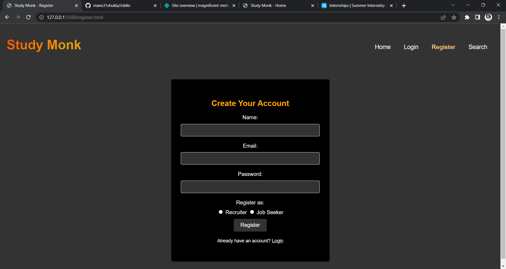
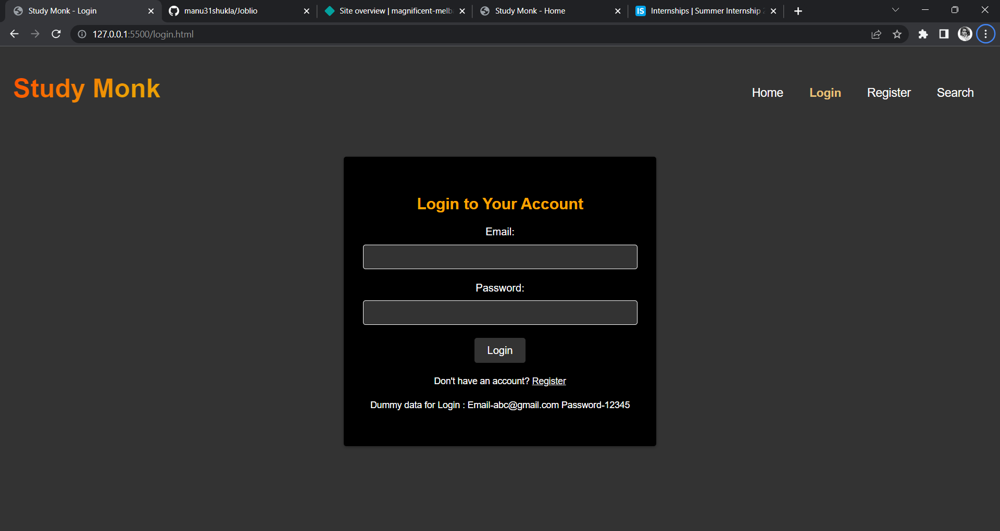

# Study Monk

Study Monk is a web application for searching and connecting with job seekers. It provides a platform for recruiters to find suitable candidates based on location and job role.

## Live Demo

Check out the live demo of the Study Monk website [here](https://magnificent-melba-a83413.netlify.app/).

## Features

- Search Candidates: Easily search for job seekers based on their location and job role.
- Interactive Home Page: The home page provides quick access to search functionality, and highlights the benefits of using Study Monk.
- User Authentication: Users can create an account, login, and access personalized features.

## Technologies Used

- HTML
- CSS
- JavaScript

## Screenshots

## Usage

1. Use the navigation bar to explore different sections of the website.

2. Use the search form to search for candidates based on location and job role.

## License

This project is licensed under the MIT License. See the [LICENSE](LICENSE) file for more details.
